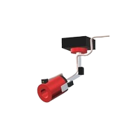

# AIPAWE

## Introduction

Fires spreading in urban areas are common, especially in residential neighborhoods where wooden houses are closely spaced with little separation between them (Ondie & Bowman, 2025). This project aims to develop a device that helps extinguish fires using acoustic sound and water.

## Roadmap

- [ ] Audio
- [x] Inference
- [x] Servo
- [ ] SMS/GSM
- [ ] Stepper

## Contact

Email: cruizallen2@gmail.com